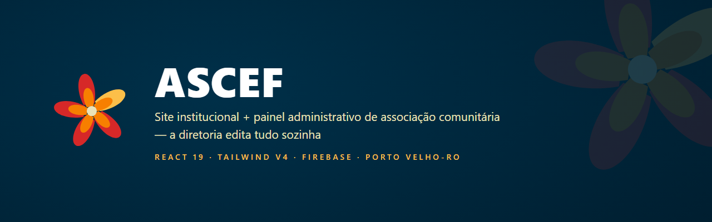
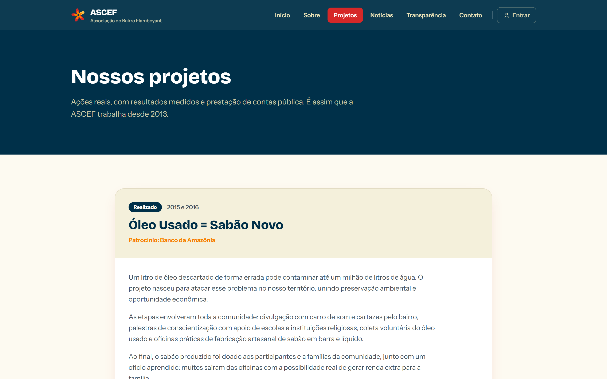
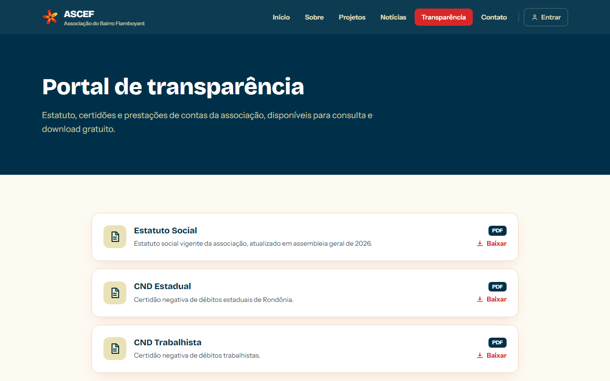
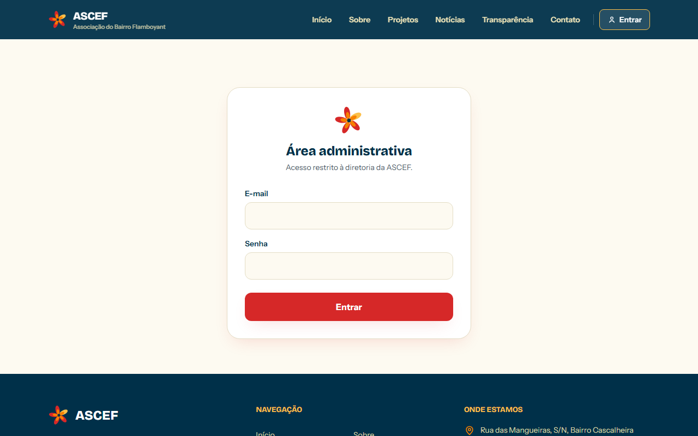

# ASCEF: Site Institucional + Painel Administrativo

**Trabalho de cliente:** site completo de associação comunitária onde a própria diretoria edita tudo (notícias, fotos, documentos e textos) sem depender de programador.

**[Ver o site no ar](https://ascef-pvh.web.app)** · **[Página do projeto](https://paulocodex.com/p/ascef)** · **[Quer um igual? Fale comigo](https://paulocodex.com)**

---

## O que é

A **ASCEF** (Associação Cultural, Educacional e de Promoção Social do Bairro Flamboyant, Porto Velho-RO) precisava de presença digital de credibilidade para captar patrocínios e parcerias, nos moldes de associações que vivem de termo de fomento. O resultado: **8 páginas com identidade própria + portal de transparência + painel administrativo completo**, do brief no WhatsApp ao ar em dias.

## Telas reais

| Home (identidade flor de flamboyant) | Projetos + galeria |
|---|---|
|  |  |

| Portal de transparência | Acesso administrativo |
|---|---|
|  |  |

## Destaques

- **Painel administrativo (CMS próprio):** a diretoria posta notícias (com rascunho), publica **fotos direto do celular** (compressão automática no navegador), gerencia os documentos da transparência e edita os textos-chave do site; mudanças entram no ar na hora.
- **Identidade única:** paleta extraída da flor de flamboyant real do bairro; motion orgânico próprio (pétalas caindo com física de 2 camadas, anel-pétala de progresso de leitura).
- **Portal de transparência:** estatuto, certidões negativas e prestação de contas para download; o site é um dossiê de credibilidade para captação de recursos.
- **Zero mensalidade de plataforma:** Firebase no plano gratuito, sem WordPress, sem construtor pago.
- **LGPD by design:** sem cookies, sem analytics, triagem de documentos com dados pessoais (disponíveis só mediante solicitação) e fotos com menores excluídas.
- **Qualidade provada, não prometida:** suítes de QA automatizadas (Playwright) rodando contra a produção: layout medido em 375/768/1440, acessibilidade (reduced-motion, foco visível, alvos ≥48px), login e CRUD exercitados de verdade.

## Stack

`React 19` · `TypeScript` · `Vite 7` · `Tailwind CSS v4` · `Firebase Hosting + Firestore + Auth` · leitura pública via REST (zero SDK no bundle público, 76 KB gz) · SDK só no chunk lazy do admin

---

## 🥷 Mascote

Todo projeto do estúdio tem o **ninja Codex** na cor da sua identidade: o mesmo mascote da casa, recolorido pro tema do **ASCEF**.

 

## Sobre o desenvolvedor

**Paulo Adriel** é produtor de vídeo e desenvolvedor indie brasileiro. Construo o produto **e** a apresentação dele (código + identidade visual, motion e material de lançamento) do zero ao ar em 30 dias. Estúdio [**Paulocodex**](https://paulocodex.com).

 

---

📧 [contato@paulocodex.com](mailto:contato@paulocodex.com) · 🌐 [paulocodex.com](https://paulocodex.com) · 📸 [@paulodev.codex](https://www.instagram.com/paulodev.codex/) · 💼 [LinkedIn](https://www.linkedin.com/in/paulo-adriel/) · 🐙 [github.com/Paulothedeveloper](https://github.com/Paulothedeveloper)

_Repositório de **apresentação pública**: o código-fonte é fechado. Nada de dado ou segredo aqui._

